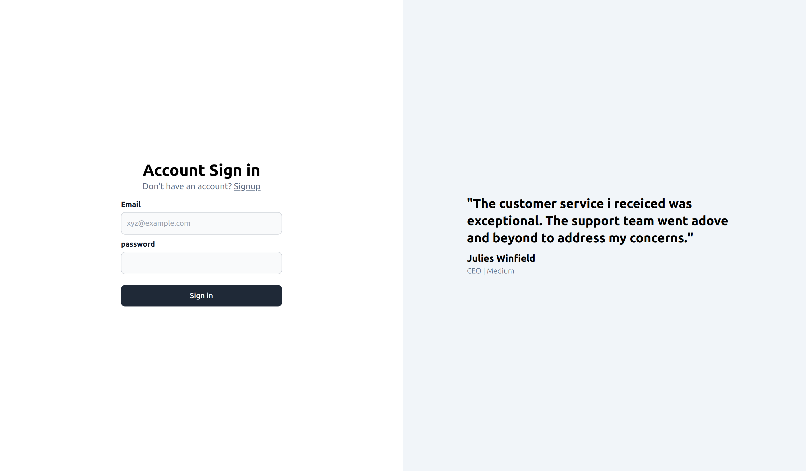
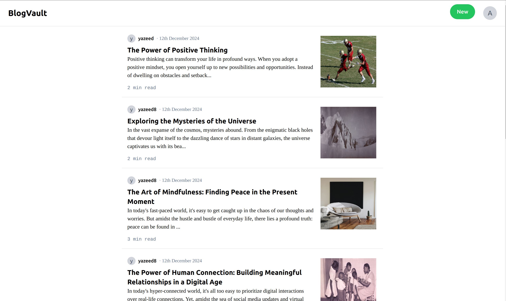
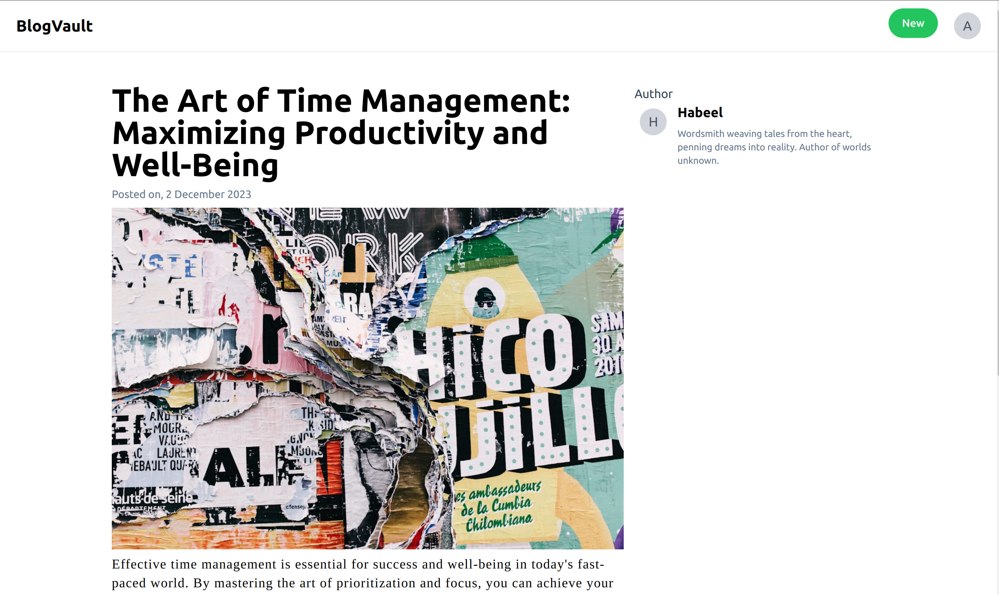
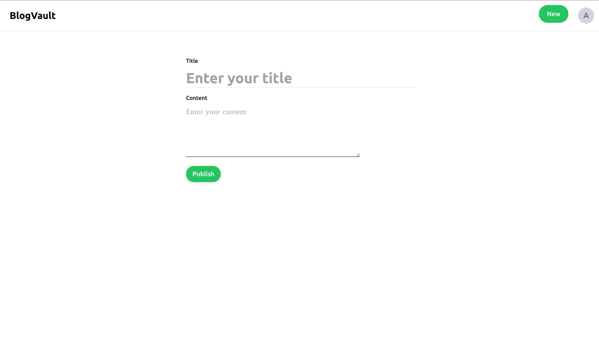

# BlogVault

BlogVault is a modern blogging application that allows users to create an account, log in, create their own blog posts, and view blog posts posted by other users. It provides a seamless and intuitive user experience with a clean and minimalist interface.

## Live link
- https://blog-vault-lake.vercel.app/

## Features

- User authentication with JWT (JSON Web Tokens)
- Secure user authentication and authorization for protected routes
- Sign up and log in functionalities
- Create and publish blog posts
- View blog posts created by other users

## Technologies Used

- **Frontend:** React, Tailwind CSS
- **Backend:** Node.js, Express.js, hono.js
- **Database:** PostgreSQL
- **ORM:** Prisma
- **API Calls:** Axios
- **Cloudflare:** Workers
- **Hosting:** Vercel

## Getting Started

### Prerequisites

Before running the application, you need to have the following installed:

- Node.js
- PostgreSQL
- Yarn (optional, but recommended)

## Demo

### Login page

### Home page

### Blog page

### Publish Blog page

## Contributing

Contributions are welcome! If you find any bugs or have any feature requests, please open an issue or submit a pull request.

## License

This project is licensed under the MIT License - see the [LICENSE](LICENSE) file for details.